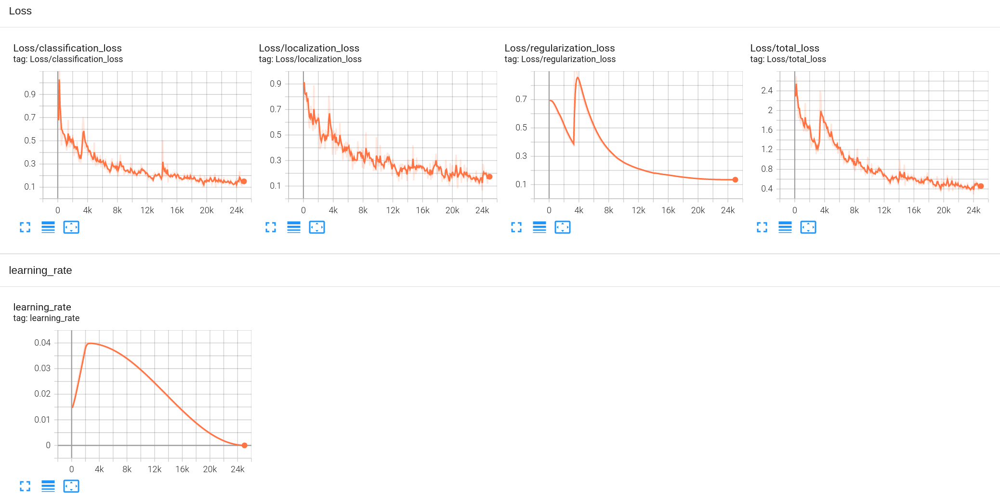
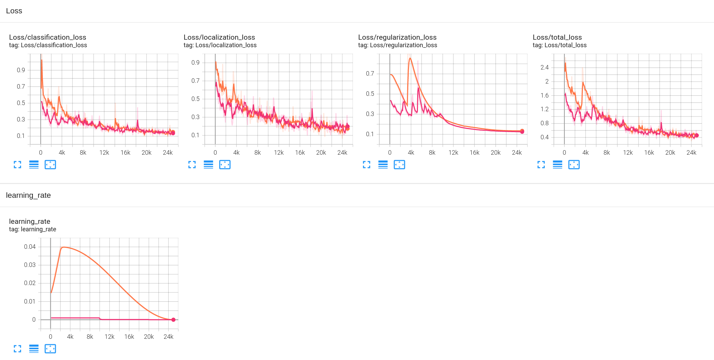
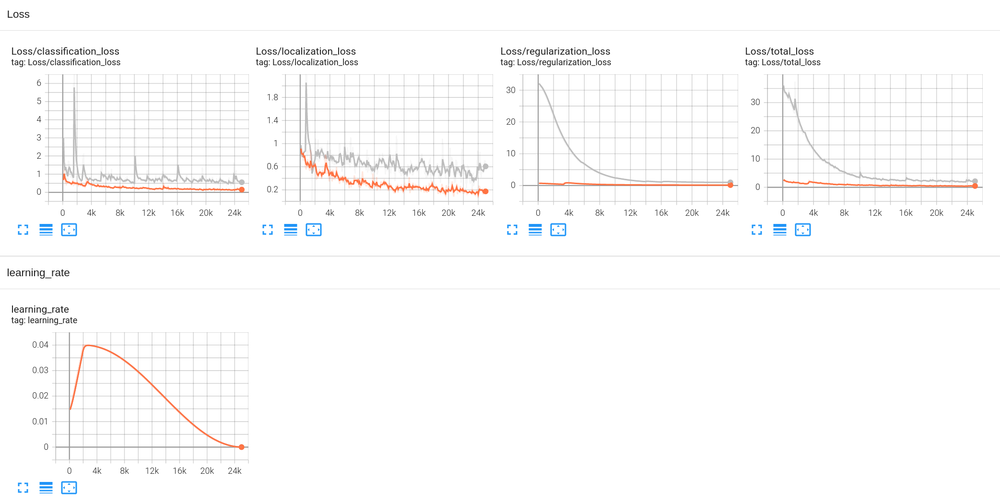
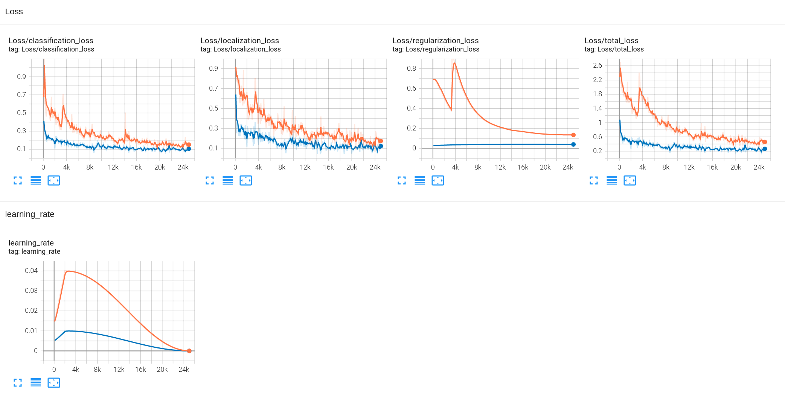

### Project overview
In this project, we will build deep learning models to detect objects in the top camera images from Waymo open data set and measure their performance. Objects include vehicles, pedestrains, and bicycles, whereas traffic signs are out of scope. These are all objects that a self-driving car should be aware of when navigating on the street. Knowing the whereabout of such objects are essential for route planning and incident avoidance.

### Set up
#### Install python and packages
```
# install python 3.8
apt install python3

# create venv
python -m venv venv

# install python packages
pip install -r requirements.txt
pip install -r requirements2.txt

# install object detection package
git clone --depth 1 git://github.com/tensorflow/models.git && \
    cd models/research/ && \
    protoc object_detection/protos/*.proto --python_out=. && \
    cp object_detection/packages/tf2/setup.py . &&\
    python -m pip install .
```

#### Download and preprocess data
The following will download 100 Waymo sample files and convert them into Tesorflow object detection record format.
```
$ python download_process.py --data_dir data --temp_dir /tmp
```

<details>
  <summary>Result</summary>

```
$ tree data
data
└── processed
    ├── segment-10017090168044687777_6380_000_6400_000_with_camera_labels.tfrecord
    ├── segment-10023947602400723454_1120_000_1140_000_with_camera_labels.tfrecord
    ├── segment-1005081002024129653_5313_150_5333_150_with_camera_labels.tfrecord
    ├── segment-10061305430875486848_1080_000_1100_000_with_camera_labels.tfrecord
    ├── segment-10072140764565668044_4060_000_4080_000_with_camera_labels.tfrecord
    ├── segment-10072231702153043603_5725_000_5745_000_with_camera_labels.tfrecord
    ├── segment-10075870402459732738_1060_000_1080_000_with_camera_labels.tfrecord
    ├── segment-10082223140073588526_6140_000_6160_000_with_camera_labels.tfrecord
    ├── segment-10094743350625019937_3420_000_3440_000_with_camera_labels.tfrecord
    ├── segment-10096619443888687526_2820_000_2840_000_with_camera_labels.tfrecord
    ├── segment-10107710434105775874_760_000_780_000_with_camera_labels.tfrecord
    ├── segment-10153695247769592104_787_000_807_000_with_camera_labels.tfrecord
    ├── segment-10206293520369375008_2796_800_2816_800_with_camera_labels.tfrecord
    ├── segment-10212406498497081993_5300_000_5320_000_with_camera_labels.tfrecord
    ├── segment-1022527355599519580_4866_960_4886_960_with_camera_labels.tfrecord
    ├── segment-10226164909075980558_180_000_200_000_with_camera_labels.tfrecord
    ├── segment-10231929575853664160_1160_000_1180_000_with_camera_labels.tfrecord
    ├── segment-10235335145367115211_5420_000_5440_000_with_camera_labels.tfrecord
    ├── segment-10241508783381919015_2889_360_2909_360_with_camera_labels.tfrecord
    ├── segment-10275144660749673822_5755_561_5775_561_with_camera_labels.tfrecord
    ├── segment-10327752107000040525_1120_000_1140_000_with_camera_labels.tfrecord
    ├── segment-10391312872392849784_4099_400_4119_400_with_camera_labels.tfrecord
    ├── segment-10444454289801298640_4360_000_4380_000_with_camera_labels.tfrecord
    ├── segment-10455472356147194054_1560_000_1580_000_with_camera_labels.tfrecord
    ├── segment-10485926982439064520_4980_000_5000_000_with_camera_labels.tfrecord
    ├── segment-10498013744573185290_1240_000_1260_000_with_camera_labels.tfrecord
    ├── segment-10500357041547037089_1474_800_1494_800_with_camera_labels.tfrecord
    ├── segment-10517728057304349900_3360_000_3380_000_with_camera_labels.tfrecord
    ├── segment-1051897962568538022_238_170_258_170_with_camera_labels.tfrecord
    ├── segment-10526338824408452410_5714_660_5734_660_with_camera_labels.tfrecord
    ├── segment-10584247114982259878_490_000_510_000_with_camera_labels.tfrecord
    ├── segment-10588771936253546636_2300_000_2320_000_with_camera_labels.tfrecord
    ├── segment-10596949720463106554_1933_530_1953_530_with_camera_labels.tfrecord
    ├── segment-10599748131695282446_1380_000_1400_000_with_camera_labels.tfrecord
    ├── segment-10625026498155904401_200_000_220_000_with_camera_labels.tfrecord
    ├── segment-10664823084372323928_4360_000_4380_000_with_camera_labels.tfrecord
    ├── segment-10676267326664322837_311_180_331_180_with_camera_labels.tfrecord
    ├── segment-10723911392655396041_860_000_880_000_with_camera_labels.tfrecord
    ├── segment-10724020115992582208_7660_400_7680_400_with_camera_labels.tfrecord
    ├── segment-10734565072045778791_440_000_460_000_with_camera_labels.tfrecord
    ├── segment-10750135302241325253_180_000_200_000_with_camera_labels.tfrecord
    ├── segment-10770759614217273359_1465_000_1485_000_with_camera_labels.tfrecord
    ├── segment-10786629299947667143_3440_000_3460_000_with_camera_labels.tfrecord
    ├── segment-10793018113277660068_2714_540_2734_540_with_camera_labels.tfrecord
    ├── segment-1083056852838271990_4080_000_4100_000_with_camera_labels.tfrecord
    ├── segment-10876852935525353526_1640_000_1660_000_with_camera_labels.tfrecord
    ├── segment-10923963890428322967_1445_000_1465_000_with_camera_labels.tfrecord
    ├── segment-10927752430968246422_4940_000_4960_000_with_camera_labels.tfrecord
    ├── segment-10940952441434390507_1888_710_1908_710_with_camera_labels.tfrecord
    ├── segment-10963653239323173269_1924_000_1944_000_with_camera_labels.tfrecord
    ├── segment-10964956617027590844_1584_680_1604_680_with_camera_labels.tfrecord
    ├── segment-10975280749486260148_940_000_960_000_with_camera_labels.tfrecord
    ├── segment-11004685739714500220_2300_000_2320_000_with_camera_labels.tfrecord
    ├── segment-11017034898130016754_697_830_717_830_with_camera_labels.tfrecord
    ├── segment-11060291335850384275_3761_210_3781_210_with_camera_labels.tfrecord
    ├── segment-11070802577416161387_740_000_760_000_with_camera_labels.tfrecord
    ├── segment-11076364019363412893_1711_000_1731_000_with_camera_labels.tfrecord
    ├── segment-11113047206980595400_2560_000_2580_000_with_camera_labels.tfrecord
    ├── segment-11119453952284076633_1369_940_1389_940_with_camera_labels.tfrecord
    ├── segment-11126313430116606120_1439_990_1459_990_with_camera_labels.tfrecord
    ├── segment-11139647661584646830_5470_000_5490_000_with_camera_labels.tfrecord
    ├── segment-11183906854663518829_2294_000_2314_000_with_camera_labels.tfrecord
    ├── segment-11199484219241918646_2810_030_2830_030_with_camera_labels.tfrecord
    ├── segment-11219370372259322863_5320_000_5340_000_with_camera_labels.tfrecord
    ├── segment-11236550977973464715_3620_000_3640_000_with_camera_labels.tfrecord
    ├── segment-11252086830380107152_1540_000_1560_000_with_camera_labels.tfrecord
    ├── segment-11318901554551149504_520_000_540_000_with_camera_labels.tfrecord
    ├── segment-11343624116265195592_5910_530_5930_530_with_camera_labels.tfrecord
    ├── segment-11355519273066561009_5323_000_5343_000_with_camera_labels.tfrecord
    ├── segment-11379226583756500423_6230_810_6250_810_with_camera_labels.tfrecord
    ├── segment-11388947676680954806_5427_320_5447_320_with_camera_labels.tfrecord
    ├── segment-11392401368700458296_1086_429_1106_429_with_camera_labels.tfrecord
    ├── segment-11454085070345530663_1905_000_1925_000_with_camera_labels.tfrecord
    ├── segment-1146261869236413282_1680_000_1700_000_with_camera_labels.tfrecord
    ├── segment-11486225968269855324_92_000_112_000_with_camera_labels.tfrecord
    ├── segment-11489533038039664633_4820_000_4840_000_with_camera_labels.tfrecord
    ├── segment-11566385337103696871_5740_000_5760_000_with_camera_labels.tfrecord
    ├── segment-11588853832866011756_2184_462_2204_462_with_camera_labels.tfrecord
    ├── segment-11623618970700582562_2840_367_2860_367_with_camera_labels.tfrecord
    ├── segment-11674150664140226235_680_000_700_000_with_camera_labels.tfrecord
    ├── segment-11718898130355901268_2300_000_2320_000_with_camera_labels.tfrecord
    ├── segment-1172406780360799916_1660_000_1680_000_with_camera_labels.tfrecord
    ├── segment-11799592541704458019_9828_750_9848_750_with_camera_labels.tfrecord
    ├── segment-11839652018869852123_2565_000_2585_000_with_camera_labels.tfrecord
    ├── segment-11846396154240966170_3540_000_3560_000_with_camera_labels.tfrecord
    ├── segment-11847506886204460250_1640_000_1660_000_with_camera_labels.tfrecord
    ├── segment-1191788760630624072_3880_000_3900_000_with_camera_labels.tfrecord
    ├── segment-11918003324473417938_1400_000_1420_000_with_camera_labels.tfrecord
    ├── segment-11925224148023145510_1040_000_1060_000_with_camera_labels.tfrecord
    ├── segment-11928449532664718059_1200_000_1220_000_with_camera_labels.tfrecord
    ├── segment-11940460932056521663_1760_000_1780_000_with_camera_labels.tfrecord
    ├── segment-11967272535264406807_580_000_600_000_with_camera_labels.tfrecord
    ├── segment-11971497357570544465_1200_000_1220_000_with_camera_labels.tfrecord
    ├── segment-12012663867578114640_820_000_840_000_with_camera_labels.tfrecord
    ├── segment-12027892938363296829_4086_280_4106_280_with_camera_labels.tfrecord
    ├── segment-1208303279778032257_1360_000_1380_000_with_camera_labels.tfrecord
    ├── segment-12161824480686739258_1813_380_1833_380_with_camera_labels.tfrecord
    ├── segment-12174529769287588121_3848_440_3868_440_with_camera_labels.tfrecord
    ├── segment-12179768245749640056_5561_070_5581_070_with_camera_labels.tfrecord
    └── segment-12200383401366682847_2552_140_2572_140_with_camera_labels.tfrecord
```
</details>

### Dataset

#### Dataset analysis
See [Exploratory Data Analysis.ipynb](./Exploratory%20Data%20Analysis.ipynb).

#### Cross validation
Three datasets for modal training, validation, and testing are generated using the following steps:
1. Make a random 80-20 split of the 100 record files. The 20 files will be the testing set.
2. For each of the 80 files, make a 80-20 split of the file. That is to save the first 80% of frames into a training file, and to save the remaining 20% of frames into a validation file. 
3. Move the resulted files into the respective directories.

The reasons to make such split are as follows:
1. For validation, we want to measure how well the model can fit to the training data and how well it can recognize patterns from data of the same distribution. Therefore, we use data from the same scenes for validation.
2. For testing, we want to see how well the model can be generalized to all possible driving conditions. Therefore, we want to use entirely new scenes for testing.

```
$ python create_splits.py --data_dir data
```

<details>
  <summary>Result</summary>

```
$ tree data
data
├── processed
│   ├── segment-10017090168044687777_6380_000_6400_000_with_camera_labels.tfrecord
│   ├── segment-10023947602400723454_1120_000_1140_000_with_camera_labels.tfrecord
│   ├── segment-1005081002024129653_5313_150_5333_150_with_camera_labels.tfrecord
│   ├── segment-10061305430875486848_1080_000_1100_000_with_camera_labels.tfrecord
│   ├── segment-10072140764565668044_4060_000_4080_000_with_camera_labels.tfrecord
│   ├── segment-10072231702153043603_5725_000_5745_000_with_camera_labels.tfrecord
│   ├── segment-10075870402459732738_1060_000_1080_000_with_camera_labels.tfrecord
│   ├── segment-10082223140073588526_6140_000_6160_000_with_camera_labels.tfrecord
│   ├── segment-10094743350625019937_3420_000_3440_000_with_camera_labels.tfrecord
│   ├── segment-10096619443888687526_2820_000_2840_000_with_camera_labels.tfrecord
│   ├── segment-10107710434105775874_760_000_780_000_with_camera_labels.tfrecord
│   ├── segment-10153695247769592104_787_000_807_000_with_camera_labels.tfrecord
│   ├── segment-10206293520369375008_2796_800_2816_800_with_camera_labels.tfrecord
│   ├── segment-10212406498497081993_5300_000_5320_000_with_camera_labels.tfrecord
│   ├── segment-1022527355599519580_4866_960_4886_960_with_camera_labels.tfrecord
│   ├── segment-10226164909075980558_180_000_200_000_with_camera_labels.tfrecord
│   ├── segment-10231929575853664160_1160_000_1180_000_with_camera_labels.tfrecord
│   ├── segment-10235335145367115211_5420_000_5440_000_with_camera_labels.tfrecord
│   ├── segment-10241508783381919015_2889_360_2909_360_with_camera_labels.tfrecord
│   ├── segment-10275144660749673822_5755_561_5775_561_with_camera_labels.tfrecord
│   ├── segment-10327752107000040525_1120_000_1140_000_with_camera_labels.tfrecord
│   ├── segment-10391312872392849784_4099_400_4119_400_with_camera_labels.tfrecord
│   ├── segment-10444454289801298640_4360_000_4380_000_with_camera_labels.tfrecord
│   ├── segment-10455472356147194054_1560_000_1580_000_with_camera_labels.tfrecord
│   ├── segment-10485926982439064520_4980_000_5000_000_with_camera_labels.tfrecord
│   ├── segment-10498013744573185290_1240_000_1260_000_with_camera_labels.tfrecord
│   ├── segment-10500357041547037089_1474_800_1494_800_with_camera_labels.tfrecord
│   ├── segment-10517728057304349900_3360_000_3380_000_with_camera_labels.tfrecord
│   ├── segment-1051897962568538022_238_170_258_170_with_camera_labels.tfrecord
│   ├── segment-10526338824408452410_5714_660_5734_660_with_camera_labels.tfrecord
│   ├── segment-10584247114982259878_490_000_510_000_with_camera_labels.tfrecord
│   ├── segment-10588771936253546636_2300_000_2320_000_with_camera_labels.tfrecord
│   ├── segment-10596949720463106554_1933_530_1953_530_with_camera_labels.tfrecord
│   ├── segment-10599748131695282446_1380_000_1400_000_with_camera_labels.tfrecord
│   ├── segment-10625026498155904401_200_000_220_000_with_camera_labels.tfrecord
│   ├── segment-10664823084372323928_4360_000_4380_000_with_camera_labels.tfrecord
│   ├── segment-10676267326664322837_311_180_331_180_with_camera_labels.tfrecord
│   ├── segment-10723911392655396041_860_000_880_000_with_camera_labels.tfrecord
│   ├── segment-10724020115992582208_7660_400_7680_400_with_camera_labels.tfrecord
│   ├── segment-10734565072045778791_440_000_460_000_with_camera_labels.tfrecord
│   ├── segment-10750135302241325253_180_000_200_000_with_camera_labels.tfrecord
│   ├── segment-10770759614217273359_1465_000_1485_000_with_camera_labels.tfrecord
│   ├── segment-10786629299947667143_3440_000_3460_000_with_camera_labels.tfrecord
│   ├── segment-10793018113277660068_2714_540_2734_540_with_camera_labels.tfrecord
│   ├── segment-1083056852838271990_4080_000_4100_000_with_camera_labels.tfrecord
│   ├── segment-10876852935525353526_1640_000_1660_000_with_camera_labels.tfrecord
│   ├── segment-10923963890428322967_1445_000_1465_000_with_camera_labels.tfrecord
│   ├── segment-10927752430968246422_4940_000_4960_000_with_camera_labels.tfrecord
│   ├── segment-10940952441434390507_1888_710_1908_710_with_camera_labels.tfrecord
│   ├── segment-10963653239323173269_1924_000_1944_000_with_camera_labels.tfrecord
│   ├── segment-10964956617027590844_1584_680_1604_680_with_camera_labels.tfrecord
│   ├── segment-10975280749486260148_940_000_960_000_with_camera_labels.tfrecord
│   ├── segment-11004685739714500220_2300_000_2320_000_with_camera_labels.tfrecord
│   ├── segment-11017034898130016754_697_830_717_830_with_camera_labels.tfrecord
│   ├── segment-11060291335850384275_3761_210_3781_210_with_camera_labels.tfrecord
│   ├── segment-11070802577416161387_740_000_760_000_with_camera_labels.tfrecord
│   ├── segment-11076364019363412893_1711_000_1731_000_with_camera_labels.tfrecord
│   ├── segment-11113047206980595400_2560_000_2580_000_with_camera_labels.tfrecord
│   ├── segment-11119453952284076633_1369_940_1389_940_with_camera_labels.tfrecord
│   ├── segment-11126313430116606120_1439_990_1459_990_with_camera_labels.tfrecord
│   ├── segment-11139647661584646830_5470_000_5490_000_with_camera_labels.tfrecord
│   ├── segment-11183906854663518829_2294_000_2314_000_with_camera_labels.tfrecord
│   ├── segment-11199484219241918646_2810_030_2830_030_with_camera_labels.tfrecord
│   ├── segment-11219370372259322863_5320_000_5340_000_with_camera_labels.tfrecord
│   ├── segment-11236550977973464715_3620_000_3640_000_with_camera_labels.tfrecord
│   ├── segment-11252086830380107152_1540_000_1560_000_with_camera_labels.tfrecord
│   ├── segment-11318901554551149504_520_000_540_000_with_camera_labels.tfrecord
│   ├── segment-11343624116265195592_5910_530_5930_530_with_camera_labels.tfrecord
│   ├── segment-11355519273066561009_5323_000_5343_000_with_camera_labels.tfrecord
│   ├── segment-11379226583756500423_6230_810_6250_810_with_camera_labels.tfrecord
│   ├── segment-11388947676680954806_5427_320_5447_320_with_camera_labels.tfrecord
│   ├── segment-11392401368700458296_1086_429_1106_429_with_camera_labels.tfrecord
│   ├── segment-11454085070345530663_1905_000_1925_000_with_camera_labels.tfrecord
│   ├── segment-1146261869236413282_1680_000_1700_000_with_camera_labels.tfrecord
│   ├── segment-11486225968269855324_92_000_112_000_with_camera_labels.tfrecord
│   ├── segment-11489533038039664633_4820_000_4840_000_with_camera_labels.tfrecord
│   ├── segment-11566385337103696871_5740_000_5760_000_with_camera_labels.tfrecord
│   ├── segment-11588853832866011756_2184_462_2204_462_with_camera_labels.tfrecord
│   ├── segment-11623618970700582562_2840_367_2860_367_with_camera_labels.tfrecord
│   ├── segment-11674150664140226235_680_000_700_000_with_camera_labels.tfrecord
│   ├── segment-11718898130355901268_2300_000_2320_000_with_camera_labels.tfrecord
│   ├── segment-1172406780360799916_1660_000_1680_000_with_camera_labels.tfrecord
│   ├── segment-11799592541704458019_9828_750_9848_750_with_camera_labels.tfrecord
│   ├── segment-11839652018869852123_2565_000_2585_000_with_camera_labels.tfrecord
│   ├── segment-11846396154240966170_3540_000_3560_000_with_camera_labels.tfrecord
│   ├── segment-11847506886204460250_1640_000_1660_000_with_camera_labels.tfrecord
│   ├── segment-1191788760630624072_3880_000_3900_000_with_camera_labels.tfrecord
│   ├── segment-11918003324473417938_1400_000_1420_000_with_camera_labels.tfrecord
│   ├── segment-11925224148023145510_1040_000_1060_000_with_camera_labels.tfrecord
│   ├── segment-11928449532664718059_1200_000_1220_000_with_camera_labels.tfrecord
│   ├── segment-11940460932056521663_1760_000_1780_000_with_camera_labels.tfrecord
│   ├── segment-11967272535264406807_580_000_600_000_with_camera_labels.tfrecord
│   ├── segment-11971497357570544465_1200_000_1220_000_with_camera_labels.tfrecord
│   ├── segment-12012663867578114640_820_000_840_000_with_camera_labels.tfrecord
│   ├── segment-12027892938363296829_4086_280_4106_280_with_camera_labels.tfrecord
│   ├── segment-1208303279778032257_1360_000_1380_000_with_camera_labels.tfrecord
│   ├── segment-12161824480686739258_1813_380_1833_380_with_camera_labels.tfrecord
│   ├── segment-12174529769287588121_3848_440_3868_440_with_camera_labels.tfrecord
│   ├── segment-12179768245749640056_5561_070_5581_070_with_camera_labels.tfrecord
│   └── segment-12200383401366682847_2552_140_2572_140_with_camera_labels.tfrecord
├── test
│   ├── segment-10017090168044687777_6380_000_6400_000_with_camera_labels.tfrecord
│   ├── segment-10153695247769592104_787_000_807_000_with_camera_labels.tfrecord
│   ├── segment-10235335145367115211_5420_000_5440_000_with_camera_labels.tfrecord
│   ├── segment-10485926982439064520_4980_000_5000_000_with_camera_labels.tfrecord
│   ├── segment-10498013744573185290_1240_000_1260_000_with_camera_labels.tfrecord
│   ├── segment-10588771936253546636_2300_000_2320_000_with_camera_labels.tfrecord
│   ├── segment-10750135302241325253_180_000_200_000_with_camera_labels.tfrecord
│   ├── segment-10927752430968246422_4940_000_4960_000_with_camera_labels.tfrecord
│   ├── segment-11060291335850384275_3761_210_3781_210_with_camera_labels.tfrecord
│   ├── segment-11119453952284076633_1369_940_1389_940_with_camera_labels.tfrecord
│   ├── segment-11199484219241918646_2810_030_2830_030_with_camera_labels.tfrecord
│   ├── segment-11343624116265195592_5910_530_5930_530_with_camera_labels.tfrecord
│   ├── segment-1146261869236413282_1680_000_1700_000_with_camera_labels.tfrecord
│   ├── segment-11489533038039664633_4820_000_4840_000_with_camera_labels.tfrecord
│   ├── segment-11623618970700582562_2840_367_2860_367_with_camera_labels.tfrecord
│   ├── segment-11799592541704458019_9828_750_9848_750_with_camera_labels.tfrecord
│   ├── segment-11847506886204460250_1640_000_1660_000_with_camera_labels.tfrecord
│   ├── segment-11925224148023145510_1040_000_1060_000_with_camera_labels.tfrecord
│   ├── segment-12161824480686739258_1813_380_1833_380_with_camera_labels.tfrecord
│   └── segment-12179768245749640056_5561_070_5581_070_with_camera_labels.tfrecord
├── train
│   ├── segment-10023947602400723454_1120_000_1140_000_with_camera_labels.tfrecord
│   ├── segment-1005081002024129653_5313_150_5333_150_with_camera_labels.tfrecord
│   ├── segment-10061305430875486848_1080_000_1100_000_with_camera_labels.tfrecord
│   ├── segment-10072140764565668044_4060_000_4080_000_with_camera_labels.tfrecord
│   ├── segment-10072231702153043603_5725_000_5745_000_with_camera_labels.tfrecord
│   ├── segment-10075870402459732738_1060_000_1080_000_with_camera_labels.tfrecord
│   ├── segment-10082223140073588526_6140_000_6160_000_with_camera_labels.tfrecord
│   ├── segment-10094743350625019937_3420_000_3440_000_with_camera_labels.tfrecord
│   ├── segment-10096619443888687526_2820_000_2840_000_with_camera_labels.tfrecord
│   ├── segment-10107710434105775874_760_000_780_000_with_camera_labels.tfrecord
│   ├── segment-10206293520369375008_2796_800_2816_800_with_camera_labels.tfrecord
│   ├── segment-10212406498497081993_5300_000_5320_000_with_camera_labels.tfrecord
│   ├── segment-1022527355599519580_4866_960_4886_960_with_camera_labels.tfrecord
│   ├── segment-10226164909075980558_180_000_200_000_with_camera_labels.tfrecord
│   ├── segment-10231929575853664160_1160_000_1180_000_with_camera_labels.tfrecord
│   ├── segment-10241508783381919015_2889_360_2909_360_with_camera_labels.tfrecord
│   ├── segment-10275144660749673822_5755_561_5775_561_with_camera_labels.tfrecord
│   ├── segment-10327752107000040525_1120_000_1140_000_with_camera_labels.tfrecord
│   ├── segment-10391312872392849784_4099_400_4119_400_with_camera_labels.tfrecord
│   ├── segment-10444454289801298640_4360_000_4380_000_with_camera_labels.tfrecord
│   ├── segment-10455472356147194054_1560_000_1580_000_with_camera_labels.tfrecord
│   ├── segment-10500357041547037089_1474_800_1494_800_with_camera_labels.tfrecord
│   ├── segment-10517728057304349900_3360_000_3380_000_with_camera_labels.tfrecord
│   ├── segment-1051897962568538022_238_170_258_170_with_camera_labels.tfrecord
│   ├── segment-10526338824408452410_5714_660_5734_660_with_camera_labels.tfrecord
│   ├── segment-10584247114982259878_490_000_510_000_with_camera_labels.tfrecord
│   ├── segment-10596949720463106554_1933_530_1953_530_with_camera_labels.tfrecord
│   ├── segment-10599748131695282446_1380_000_1400_000_with_camera_labels.tfrecord
│   ├── segment-10625026498155904401_200_000_220_000_with_camera_labels.tfrecord
│   ├── segment-10664823084372323928_4360_000_4380_000_with_camera_labels.tfrecord
│   ├── segment-10676267326664322837_311_180_331_180_with_camera_labels.tfrecord
│   ├── segment-10723911392655396041_860_000_880_000_with_camera_labels.tfrecord
│   ├── segment-10724020115992582208_7660_400_7680_400_with_camera_labels.tfrecord
│   ├── segment-10734565072045778791_440_000_460_000_with_camera_labels.tfrecord
│   ├── segment-10770759614217273359_1465_000_1485_000_with_camera_labels.tfrecord
│   ├── segment-10786629299947667143_3440_000_3460_000_with_camera_labels.tfrecord
│   ├── segment-10793018113277660068_2714_540_2734_540_with_camera_labels.tfrecord
│   ├── segment-1083056852838271990_4080_000_4100_000_with_camera_labels.tfrecord
│   ├── segment-10876852935525353526_1640_000_1660_000_with_camera_labels.tfrecord
│   ├── segment-10923963890428322967_1445_000_1465_000_with_camera_labels.tfrecord
│   ├── segment-10940952441434390507_1888_710_1908_710_with_camera_labels.tfrecord
│   ├── segment-10963653239323173269_1924_000_1944_000_with_camera_labels.tfrecord
│   ├── segment-10964956617027590844_1584_680_1604_680_with_camera_labels.tfrecord
│   ├── segment-10975280749486260148_940_000_960_000_with_camera_labels.tfrecord
│   ├── segment-11004685739714500220_2300_000_2320_000_with_camera_labels.tfrecord
│   ├── segment-11017034898130016754_697_830_717_830_with_camera_labels.tfrecord
│   ├── segment-11070802577416161387_740_000_760_000_with_camera_labels.tfrecord
│   ├── segment-11076364019363412893_1711_000_1731_000_with_camera_labels.tfrecord
│   ├── segment-11113047206980595400_2560_000_2580_000_with_camera_labels.tfrecord
│   ├── segment-11126313430116606120_1439_990_1459_990_with_camera_labels.tfrecord
│   ├── segment-11139647661584646830_5470_000_5490_000_with_camera_labels.tfrecord
│   ├── segment-11183906854663518829_2294_000_2314_000_with_camera_labels.tfrecord
│   ├── segment-11219370372259322863_5320_000_5340_000_with_camera_labels.tfrecord
│   ├── segment-11236550977973464715_3620_000_3640_000_with_camera_labels.tfrecord
│   ├── segment-11252086830380107152_1540_000_1560_000_with_camera_labels.tfrecord
│   ├── segment-11318901554551149504_520_000_540_000_with_camera_labels.tfrecord
│   ├── segment-11355519273066561009_5323_000_5343_000_with_camera_labels.tfrecord
│   ├── segment-11379226583756500423_6230_810_6250_810_with_camera_labels.tfrecord
│   ├── segment-11388947676680954806_5427_320_5447_320_with_camera_labels.tfrecord
│   ├── segment-11392401368700458296_1086_429_1106_429_with_camera_labels.tfrecord
│   ├── segment-11454085070345530663_1905_000_1925_000_with_camera_labels.tfrecord
│   ├── segment-11486225968269855324_92_000_112_000_with_camera_labels.tfrecord
│   ├── segment-11566385337103696871_5740_000_5760_000_with_camera_labels.tfrecord
│   ├── segment-11588853832866011756_2184_462_2204_462_with_camera_labels.tfrecord
│   ├── segment-11674150664140226235_680_000_700_000_with_camera_labels.tfrecord
│   ├── segment-11718898130355901268_2300_000_2320_000_with_camera_labels.tfrecord
│   ├── segment-1172406780360799916_1660_000_1680_000_with_camera_labels.tfrecord
│   ├── segment-11839652018869852123_2565_000_2585_000_with_camera_labels.tfrecord
│   ├── segment-11846396154240966170_3540_000_3560_000_with_camera_labels.tfrecord
│   ├── segment-1191788760630624072_3880_000_3900_000_with_camera_labels.tfrecord
│   ├── segment-11918003324473417938_1400_000_1420_000_with_camera_labels.tfrecord
│   ├── segment-11928449532664718059_1200_000_1220_000_with_camera_labels.tfrecord
│   ├── segment-11940460932056521663_1760_000_1780_000_with_camera_labels.tfrecord
│   ├── segment-11967272535264406807_580_000_600_000_with_camera_labels.tfrecord
│   ├── segment-11971497357570544465_1200_000_1220_000_with_camera_labels.tfrecord
│   ├── segment-12012663867578114640_820_000_840_000_with_camera_labels.tfrecord
│   ├── segment-12027892938363296829_4086_280_4106_280_with_camera_labels.tfrecord
│   ├── segment-1208303279778032257_1360_000_1380_000_with_camera_labels.tfrecord
│   ├── segment-12174529769287588121_3848_440_3868_440_with_camera_labels.tfrecord
│   └── segment-12200383401366682847_2552_140_2572_140_with_camera_labels.tfrecord
└── val
    ├── segment-10023947602400723454_1120_000_1140_000_with_camera_labels.tfrecord
    ├── segment-1005081002024129653_5313_150_5333_150_with_camera_labels.tfrecord
    ├── segment-10061305430875486848_1080_000_1100_000_with_camera_labels.tfrecord
    ├── segment-10072140764565668044_4060_000_4080_000_with_camera_labels.tfrecord
    ├── segment-10072231702153043603_5725_000_5745_000_with_camera_labels.tfrecord
    ├── segment-10075870402459732738_1060_000_1080_000_with_camera_labels.tfrecord
    ├── segment-10082223140073588526_6140_000_6160_000_with_camera_labels.tfrecord
    ├── segment-10094743350625019937_3420_000_3440_000_with_camera_labels.tfrecord
    ├── segment-10096619443888687526_2820_000_2840_000_with_camera_labels.tfrecord
    ├── segment-10107710434105775874_760_000_780_000_with_camera_labels.tfrecord
    ├── segment-10206293520369375008_2796_800_2816_800_with_camera_labels.tfrecord
    ├── segment-10212406498497081993_5300_000_5320_000_with_camera_labels.tfrecord
    ├── segment-1022527355599519580_4866_960_4886_960_with_camera_labels.tfrecord
    ├── segment-10226164909075980558_180_000_200_000_with_camera_labels.tfrecord
    ├── segment-10231929575853664160_1160_000_1180_000_with_camera_labels.tfrecord
    ├── segment-10241508783381919015_2889_360_2909_360_with_camera_labels.tfrecord
    ├── segment-10275144660749673822_5755_561_5775_561_with_camera_labels.tfrecord
    ├── segment-10327752107000040525_1120_000_1140_000_with_camera_labels.tfrecord
    ├── segment-10391312872392849784_4099_400_4119_400_with_camera_labels.tfrecord
    ├── segment-10444454289801298640_4360_000_4380_000_with_camera_labels.tfrecord
    ├── segment-10455472356147194054_1560_000_1580_000_with_camera_labels.tfrecord
    ├── segment-10500357041547037089_1474_800_1494_800_with_camera_labels.tfrecord
    ├── segment-10517728057304349900_3360_000_3380_000_with_camera_labels.tfrecord
    ├── segment-1051897962568538022_238_170_258_170_with_camera_labels.tfrecord
    ├── segment-10526338824408452410_5714_660_5734_660_with_camera_labels.tfrecord
    ├── segment-10584247114982259878_490_000_510_000_with_camera_labels.tfrecord
    ├── segment-10596949720463106554_1933_530_1953_530_with_camera_labels.tfrecord
    ├── segment-10599748131695282446_1380_000_1400_000_with_camera_labels.tfrecord
    ├── segment-10625026498155904401_200_000_220_000_with_camera_labels.tfrecord
    ├── segment-10664823084372323928_4360_000_4380_000_with_camera_labels.tfrecord
    ├── segment-10676267326664322837_311_180_331_180_with_camera_labels.tfrecord
    ├── segment-10723911392655396041_860_000_880_000_with_camera_labels.tfrecord
    ├── segment-10724020115992582208_7660_400_7680_400_with_camera_labels.tfrecord
    ├── segment-10734565072045778791_440_000_460_000_with_camera_labels.tfrecord
    ├── segment-10770759614217273359_1465_000_1485_000_with_camera_labels.tfrecord
    ├── segment-10786629299947667143_3440_000_3460_000_with_camera_labels.tfrecord
    ├── segment-10793018113277660068_2714_540_2734_540_with_camera_labels.tfrecord
    ├── segment-1083056852838271990_4080_000_4100_000_with_camera_labels.tfrecord
    ├── segment-10876852935525353526_1640_000_1660_000_with_camera_labels.tfrecord
    ├── segment-10923963890428322967_1445_000_1465_000_with_camera_labels.tfrecord
    ├── segment-10940952441434390507_1888_710_1908_710_with_camera_labels.tfrecord
    ├── segment-10963653239323173269_1924_000_1944_000_with_camera_labels.tfrecord
    ├── segment-10964956617027590844_1584_680_1604_680_with_camera_labels.tfrecord
    ├── segment-10975280749486260148_940_000_960_000_with_camera_labels.tfrecord
    ├── segment-11004685739714500220_2300_000_2320_000_with_camera_labels.tfrecord
    ├── segment-11017034898130016754_697_830_717_830_with_camera_labels.tfrecord
    ├── segment-11070802577416161387_740_000_760_000_with_camera_labels.tfrecord
    ├── segment-11076364019363412893_1711_000_1731_000_with_camera_labels.tfrecord
    ├── segment-11113047206980595400_2560_000_2580_000_with_camera_labels.tfrecord
    ├── segment-11126313430116606120_1439_990_1459_990_with_camera_labels.tfrecord
    ├── segment-11139647661584646830_5470_000_5490_000_with_camera_labels.tfrecord
    ├── segment-11183906854663518829_2294_000_2314_000_with_camera_labels.tfrecord
    ├── segment-11219370372259322863_5320_000_5340_000_with_camera_labels.tfrecord
    ├── segment-11236550977973464715_3620_000_3640_000_with_camera_labels.tfrecord
    ├── segment-11252086830380107152_1540_000_1560_000_with_camera_labels.tfrecord
    ├── segment-11318901554551149504_520_000_540_000_with_camera_labels.tfrecord
    ├── segment-11355519273066561009_5323_000_5343_000_with_camera_labels.tfrecord
    ├── segment-11379226583756500423_6230_810_6250_810_with_camera_labels.tfrecord
    ├── segment-11388947676680954806_5427_320_5447_320_with_camera_labels.tfrecord
    ├── segment-11392401368700458296_1086_429_1106_429_with_camera_labels.tfrecord
    ├── segment-11454085070345530663_1905_000_1925_000_with_camera_labels.tfrecord
    ├── segment-11486225968269855324_92_000_112_000_with_camera_labels.tfrecord
    ├── segment-11566385337103696871_5740_000_5760_000_with_camera_labels.tfrecord
    ├── segment-11588853832866011756_2184_462_2204_462_with_camera_labels.tfrecord
    ├── segment-11674150664140226235_680_000_700_000_with_camera_labels.tfrecord
    ├── segment-11718898130355901268_2300_000_2320_000_with_camera_labels.tfrecord
    ├── segment-1172406780360799916_1660_000_1680_000_with_camera_labels.tfrecord
    ├── segment-11839652018869852123_2565_000_2585_000_with_camera_labels.tfrecord
    ├── segment-11846396154240966170_3540_000_3560_000_with_camera_labels.tfrecord
    ├── segment-1191788760630624072_3880_000_3900_000_with_camera_labels.tfrecord
    ├── segment-11918003324473417938_1400_000_1420_000_with_camera_labels.tfrecord
    ├── segment-11928449532664718059_1200_000_1220_000_with_camera_labels.tfrecord
    ├── segment-11940460932056521663_1760_000_1780_000_with_camera_labels.tfrecord
    ├── segment-11967272535264406807_580_000_600_000_with_camera_labels.tfrecord
    ├── segment-11971497357570544465_1200_000_1220_000_with_camera_labels.tfrecord
    ├── segment-12012663867578114640_820_000_840_000_with_camera_labels.tfrecord
    ├── segment-12027892938363296829_4086_280_4106_280_with_camera_labels.tfrecord
    ├── segment-1208303279778032257_1360_000_1380_000_with_camera_labels.tfrecord
    ├── segment-12174529769287588121_3848_440_3868_440_with_camera_labels.tfrecord
    └── segment-12200383401366682847_2552_140_2572_140_with_camera_labels.tfrecord

4 directories, 280 files

```
</details>


### Training 
#### Experiment 1: Reference experiment
The reference experiment uses the `ssd_resnet50_v1_fpn_640x640_coco17_tpu-8` pretrained model as a baseline and uses the default training parameters in the `pipeline.config`. Due to the limited memory of the GPU card, we can only run the training process and the evaluation process sequentially. 

The following Tensorboard chart illustrate the training process:


The performance metrics, evaluated on the validation set, are as follows:
```
 Average Precision  (AP) @[ IoU=0.50:0.95 | area=   all | maxDets=100 ] = 0.186
 Average Precision  (AP) @[ IoU=0.50      | area=   all | maxDets=100 ] = 0.362
 Average Precision  (AP) @[ IoU=0.75      | area=   all | maxDets=100 ] = 0.165
 Average Precision  (AP) @[ IoU=0.50:0.95 | area= small | maxDets=100 ] = 0.086
 Average Precision  (AP) @[ IoU=0.50:0.95 | area=medium | maxDets=100 ] = 0.452
 Average Precision  (AP) @[ IoU=0.50:0.95 | area= large | maxDets=100 ] = 0.562
 Average Recall     (AR) @[ IoU=0.50:0.95 | area=   all | maxDets=  1 ] = 0.037
 Average Recall     (AR) @[ IoU=0.50:0.95 | area=   all | maxDets= 10 ] = 0.173
 Average Recall     (AR) @[ IoU=0.50:0.95 | area=   all | maxDets=100 ] = 0.275
 Average Recall     (AR) @[ IoU=0.50:0.95 | area= small | maxDets=100 ] = 0.182
 Average Recall     (AR) @[ IoU=0.50:0.95 | area=medium | maxDets=100 ] = 0.559
 Average Recall     (AR) @[ IoU=0.50:0.95 | area= large | maxDets=100 ] = 0.676
```

The following illustrates the result of applying the model to a scene. Ground truch bounding boxes are in red. The model is fairly accurate at predicting easy/large objects. False positives are rare. Many objects are not detected, though, which is not surprising given the model's low average recall score.


Here is another scene for which the model performs especially bad. Bushes on the roadside are mistaken as either vehicles or pedestrains.


#### Experiment 2: Data augmentation
In this experiment, random color distortion is introduced as a transformation step in the training, otherwise the model is the same as the baseline. The intuition is that color shouldn't be a strong feature in detecting objects. By varing the colors, the model should learn to ignore color and relying on more relevant features. 

The effect of color distortion is depicted in [Explore augmentations.ipynb](./Explore%20augmentations.ipynb)

The training progress is illustrated below, the baseline being orange.


The performance metrics, evaluated on the validation set, are as follows:
```
 Average Precision  (AP) @[ IoU=0.50:0.95 | area=   all | maxDets=100 ] = 0.201
 Average Precision  (AP) @[ IoU=0.50      | area=   all | maxDets=100 ] = 0.391
 Average Precision  (AP) @[ IoU=0.75      | area=   all | maxDets=100 ] = 0.177
 Average Precision  (AP) @[ IoU=0.50:0.95 | area= small | maxDets=100 ] = 0.096
 Average Precision  (AP) @[ IoU=0.50:0.95 | area=medium | maxDets=100 ] = 0.494
 Average Precision  (AP) @[ IoU=0.50:0.95 | area= large | maxDets=100 ] = 0.585
 Average Recall     (AR) @[ IoU=0.50:0.95 | area=   all | maxDets=  1 ] = 0.038
 Average Recall     (AR) @[ IoU=0.50:0.95 | area=   all | maxDets= 10 ] = 0.183
 Average Recall     (AR) @[ IoU=0.50:0.95 | area=   all | maxDets=100 ] = 0.285
 Average Recall     (AR) @[ IoU=0.50:0.95 | area= small | maxDets=100 ] = 0.191
 Average Recall     (AR) @[ IoU=0.50:0.95 | area=medium | maxDets=100 ] = 0.578
 Average Recall     (AR) @[ IoU=0.50:0.95 | area= large | maxDets=100 ] = 0.672
 ```

Compared to the baseline, the new model's average precision improves by 8% (0.201/0.186-1), while the average recall also improves by 4% (0.285/0.275-1). Therefore, the random color distortion seems to have a positive impact to the model performance.

For the scene that experiment 1 preforms poorly, experiment 2 does pretty well. The false positives are significantly surpressed.


#### Experiment 3: Adam optimizer
In this experiment, Adam optimizer is used in place of the momentum optimizer, otherwise it's the same as experiment #2. The same number of training steps (25000) is applied. The learning rate is manually specified starting at 1e-3, decreased to 1e-4 after 10000 steps, then decreased again to 1e-5 after 20000 steps. 

The training looks like the following, the baseline being orange.


Notable in the chart is that the losses decrease quickly in the first 2000 steps then stablize or even increase in the next 8000 steps, and start to decrese again after the first 10000 steps. This can indicate the learning rate is too big for too long. A sooner decay may shorten the training time.

The performance metrics, evaluated on the validation set, are as follows:
```
 Average Precision  (AP) @[ IoU=0.50:0.95 | area=   all | maxDets=100 ] = 0.200
 Average Precision  (AP) @[ IoU=0.50      | area=   all | maxDets=100 ] = 0.384
 Average Precision  (AP) @[ IoU=0.75      | area=   all | maxDets=100 ] = 0.179
 Average Precision  (AP) @[ IoU=0.50:0.95 | area= small | maxDets=100 ] = 0.100
 Average Precision  (AP) @[ IoU=0.50:0.95 | area=medium | maxDets=100 ] = 0.503
 Average Precision  (AP) @[ IoU=0.50:0.95 | area= large | maxDets=100 ] = 0.507
 Average Recall     (AR) @[ IoU=0.50:0.95 | area=   all | maxDets=  1 ] = 0.039
 Average Recall     (AR) @[ IoU=0.50:0.95 | area=   all | maxDets= 10 ] = 0.185
 Average Recall     (AR) @[ IoU=0.50:0.95 | area=   all | maxDets=100 ] = 0.285
 Average Recall     (AR) @[ IoU=0.50:0.95 | area= small | maxDets=100 ] = 0.188
 Average Recall     (AR) @[ IoU=0.50:0.95 | area=medium | maxDets=100 ] = 0.593
 Average Recall     (AR) @[ IoU=0.50:0.95 | area= large | maxDets=100 ] = 0.672
```

Performance of this experiment is almost identical to the previous one, which is reasonable since it's exactly the same architecture, only the optimizer is different. Training efficiency or speed of convergence can potentially be different.  However, not much conclusion can be drawn from a single run.

For the challenge scene, experiment 3 performs equally well. 


#### Experiment 4: Resnet 101
In this experiment, a deeper network `ssd_resnet101_v1_fpn_640x640_coco17_tpu-8` is used to replace Resnet50, otherwise it's the same as experiment #2. Theoretically, the model should perform better than its shallow counterpart. 

The actually training process is as follows, the baseline being orange.


The training converges badly. The regularization loss is too high and dominant, and the model has a hard time to overcome its impact. This is indicative of poor hyperparameter selection.

The performance metrics, evaluated on the validation set, are as follows:
```
 Average Precision  (AP) @[ IoU=0.50:0.95 | area=   all | maxDets=100 ] = 0.007
 Average Precision  (AP) @[ IoU=0.50      | area=   all | maxDets=100 ] = 0.018
 Average Precision  (AP) @[ IoU=0.75      | area=   all | maxDets=100 ] = 0.005
 Average Precision  (AP) @[ IoU=0.50:0.95 | area= small | maxDets=100 ] = 0.003
 Average Precision  (AP) @[ IoU=0.50:0.95 | area=medium | maxDets=100 ] = 0.036
 Average Precision  (AP) @[ IoU=0.50:0.95 | area= large | maxDets=100 ] = 0.033
 Average Recall     (AR) @[ IoU=0.50:0.95 | area=   all | maxDets=  1 ] = 0.006
 Average Recall     (AR) @[ IoU=0.50:0.95 | area=   all | maxDets= 10 ] = 0.024
 Average Recall     (AR) @[ IoU=0.50:0.95 | area=   all | maxDets=100 ] = 0.056
 Average Recall     (AR) @[ IoU=0.50:0.95 | area= small | maxDets=100 ] = 0.010
 Average Recall     (AR) @[ IoU=0.50:0.95 | area=medium | maxDets=100 ] = 0.157
 Average Recall     (AR) @[ IoU=0.50:0.95 | area= large | maxDets=100 ] = 0.287
```

#### Experiment 5: Resnet 101 new configuration
In this experiment, a few changes are made versus experiment 4: 1) regularizer weight is reduced from 0.0004 to 0.00004; 2) learning_rate_base is reduced from 0.04 to 0.01; 3) warmup_learning_rate is reduced from 0.013333 to 0.005; 4) color distortion transformation is removed (this is not intentional). The purpose is to temper the regularization loss and to avoid divergence due to high learning rate. 

The training progress is as follows, the baseline being orange.


The changes make a huge difference, as training coverges much fast than experiment 4 and also the baseline. 

The performance metrics, evaluated on the validation set, are as follows:
```
 Average Precision  (AP) @[ IoU=0.50:0.95 | area=   all | maxDets=100 ] = 0.249
 Average Precision  (AP) @[ IoU=0.50      | area=   all | maxDets=100 ] = 0.471
 Average Precision  (AP) @[ IoU=0.75      | area=   all | maxDets=100 ] = 0.223
 Average Precision  (AP) @[ IoU=0.50:0.95 | area= small | maxDets=100 ] = 0.133
 Average Precision  (AP) @[ IoU=0.50:0.95 | area=medium | maxDets=100 ] = 0.572
 Average Precision  (AP) @[ IoU=0.50:0.95 | area= large | maxDets=100 ] = 0.647
 Average Recall     (AR) @[ IoU=0.50:0.95 | area=   all | maxDets=  1 ] = 0.045
 Average Recall     (AR) @[ IoU=0.50:0.95 | area=   all | maxDets= 10 ] = 0.218
 Average Recall     (AR) @[ IoU=0.50:0.95 | area=   all | maxDets=100 ] = 0.333
 Average Recall     (AR) @[ IoU=0.50:0.95 | area= small | maxDets=100 ] = 0.234
 Average Recall     (AR) @[ IoU=0.50:0.95 | area=medium | maxDets=100 ] = 0.643
 Average Recall     (AR) @[ IoU=0.50:0.95 | area= large | maxDets=100 ] = 0.749
```

The average precision improves 34% over baseline, and the average recall improves 21%. 

For the challenge scene, experiment 5 performs much better than the baseline, even if the color distortion augmentation is not applied. 


